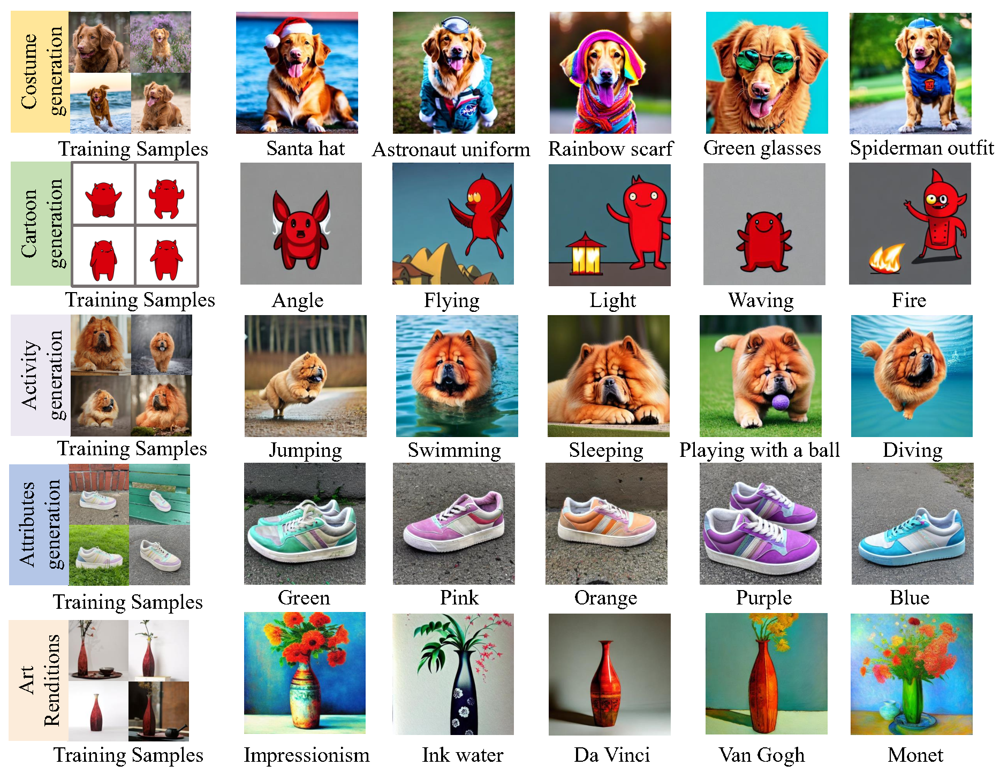

# CL-Diffusion
> **Subject-Driven Text-to-Image Generation**  
> Costume 🎩 · Cartoon 🤖 · Activity 🏃 · Attributes 👟 · Art Renditions 🎨

---

## ✨ Showcase

---

## 🛠️ Requirements

- 💾 **diffusers** `>=0.23.1`
- 🧠 **open_clip_torch**
- 🖼️ **torchvision**
- ⚡ **Hardware**: at least **1 × 16 GB** NVIDIA GPU

## 🏋️ Finetune

<pre> bash train_cl.sh </pre>

📚 Dataset
Download the DreamBooth Dataset from the official repo and unzip into dataset/

Grab the pretrained Stable Diffusion 2-1 checkpoint and place it in pretrained/

